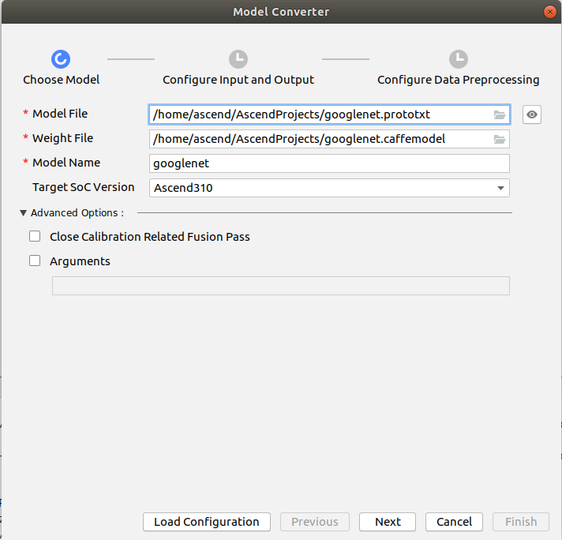
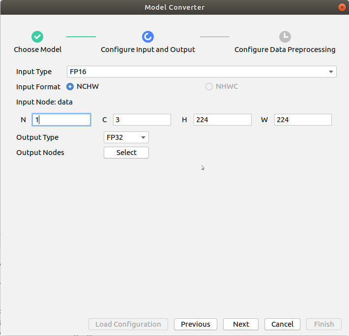
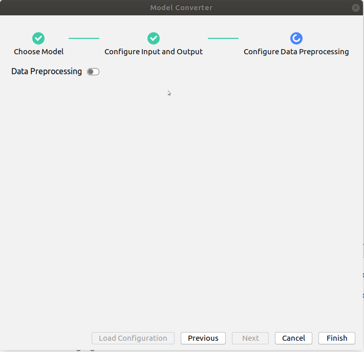
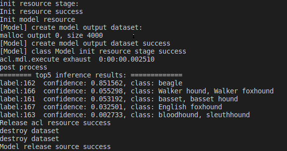

# Image Object Classification Network Application (Python)

This application can run on the Atlas 200 DK to classify objects in images using the GoogLeNet network and output the top five classes with the highest confidence scores.

## Software Preparation

Before running this sample, obtain the source code package.

1. Obtain the source code package.   
   **mkdir -p $HOME/AscendProjects**
   
   **cd $HOME/AscendProjects**
   
   **git clone https://github.com/Atlas200dk/sample_image_classification_c73_python.git**
   
   OR
   
   **wget https://github.com/Atlas200dk/sample_image_classification_c73_python.git**   

   Then, unzip the downloaded file:

   **unzip sample_image_classification_c73_python.zip**  
   
2. Obtain the original model required by the application.
   
   Obtain the original model file and weight file by referring to [Table 1 Model for an image classification application](#zh-cn_topic_0219108795_table19942111763710) and store them to any directory of the Ubuntu server where Mind Studio is installed.
   
   **Table 1** Model for an image classification application

    
    
    <table><thead align="left"><tr id="zh-cn_topic_0219108795_row611318123710"><th class="cellrowborder" valign="top" width="11.959999999999999%" id="mcps1.2.4.1.1">
Model name

    </th>
    <th class="cellrowborder" valign="top" width="8.07%" id="mcps1.2.4.1.2">
Model description

    </th>
    <th class="cellrowborder" valign="top" width="79.97%" id="mcps1.2.4.1.3">
Model download link

    </th>
    </tr>
    </thead>
    <tbody><tr id="zh-cn_topic_0219108795_row1119187377"><td class="cellrowborder" valign="top" width="11.959999999999999%" headers="mcps1.2.4.1.1 ">
googlenet

    </td>
    <td class="cellrowborder" valign="top" width="8.07%" headers="mcps1.2.4.1.2 ">
Image classification model
    It is a GoogLeNet model based on Caffe.

    
    </td>
    <td class="cellrowborder" valign="top" width="79.97%" headers="mcps1.2.4.1.3 ">
Download the original model file and weight file by referring to README_en.md at <a href="https://github.com/Ascend-Huawei/models/blob/master/computer_vision/classification/googlenet/README_en.md" target="_blank" rel="noopener noreferrer">https://github.com/Ascend-Huawei/models/blob/master/computer_vision/classification/googlenet/README_en.md</a>. 

    </td>
    </tr>
    </tbody>
    </table>
   
3. Convert the original model to an offline model adapted to the Ascend AI Processor.
   
   1. Choose **Tools** \> **Model **Converter**** from the menu bar of Mind Studio.
   2. Configure the model conversion settings in the displayed **Model Converter** dialog box.
   3. Set the parameters by referring to the following figure.
      - Select the model file downloaded in [Step 2](#zh-cn_topic_0219108795_li2074865610364) in **Model File**, and **Weight File** is automatically filled in.
      - Set the model name to **googlenet**.
      - Set **Input Type** to **FP16** and set the value of **N** in **Input Node: data** to **1**.
      - Disable **Data Preprocessing**
      
      
      
    

4. Save the converted model to the **model** directory in the project file.  

    **mkdir ~/AscendProjects/sample_image_classification_c73_python/model/**
    
    **cp ~/modelzoo/googlenet/device/googlenet.om ~/AscendProjects/sample_image_classification_c73_python/model/**

## Environment Deployment

1. Copy the application code to the developer board.
   
   Go to the root directory of the classification network application code \(Python\) as the Mind Studio installation user, for example, **AscendProjects/sample_image_classification_c73_python**, and run the following command to copy the application code to the developer board:
   
   **scp -r ~/AscendProjects/sample_image_classification_c73_python HwHiAiUser@192.168.1.2:/home/HwHiAiUser/HIAI\_PROJECTS**
   
   Enter the password of the developer board as prompted. The default password is **Mind@123**

2. Log in to the developer board and add environment variables.
   
   **ssh HwHiAiUser@192.168.1.2**  
   **vim ~/.bashrc**   
   Append the following two lines:   
   **export LD_LIBRARY_PATH=/home/HwHiAiUser/Ascend/acllib/lib64**  
   **export PYTHONPATH=/home/HwHiAiUser/Ascend/:\${PYTHONPATH}**  
      
   Run the following command for the environment variables to take effect:   
   **source ~/.bashrc**

## Run

1. Log in to the developer board, go to the project directory, and run the following command to run the application:
   
   **cd ~/HIAI_PROJECTS/sample_image_classification_c73_python/**  
   **python3 main.py**

2. View the inference result on the terminal window.
   
   

3. View the result images.
   
   The result images are stored in the **outputs** folder and can be uploaded to the home directory of the Mind Studio installation user. 
   
   Run the following from Mind Studio installation server.
   
   **scp -r username@host\_ip:/home/username/HIAI\_PROJECTS/sample_image_classification_c73_python/outputs \~**
   
   - **username**: user name of the developer board, default to **HwHiAiUser**.
   - **host\_ip**: IP address of the developer board. Generally, for USB connection, the IP address is **192.168.1.2**. For network cable connection, the IP address if **192.168.0.2**.
   
   **Example:**   
   **scp -r HwHiAiUser@192.168.1.2:/home/HwHiAiUser/HIAI\_PROJECTS/sample_image_classification_c73_python/outputs \~** 
   
   Then, you will find the **Result.jpg** in **~/outputs/**
